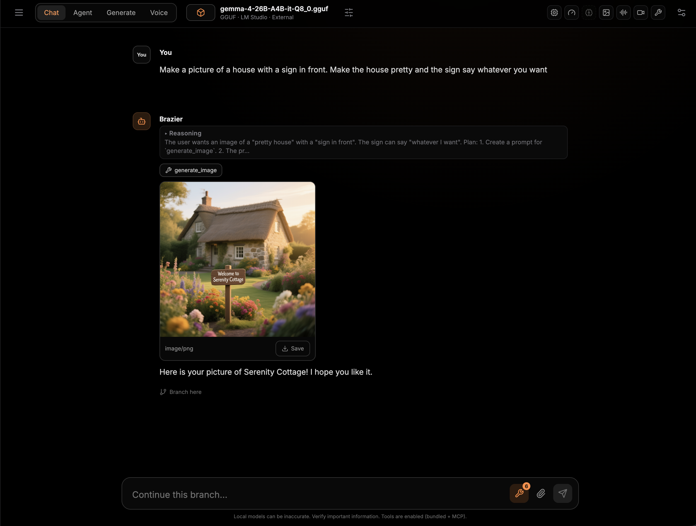
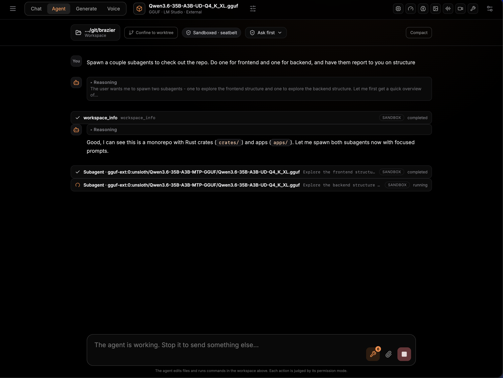

# Brazier

Brazier is an MIT-licensed desktop client and local API for running open weight AI
models. It features LLMs with llama.cpp, mlx-lm, and mlx-vlm backends; image and video models with stable-diffusion.cpp (and tool integration for LLMs to call them); bidirectional voice with PersonaPlex, and contains a modular agent harness (Pi).

<p align="center">
  
  
</p>

## Downloads


- [Download for macOS (Apple Silicon)](https://github.com/dylancvdean/brazier/releases/latest/download/Brazier.dmg)
- [Download for Linux (AppImage)](https://github.com/dylancvdean/brazier/releases/latest/download/Brazier.AppImage)
- [Download for Windows (NSIS)](https://github.com/dylancvdean/brazier/releases/latest/download/Brazier-Setup.exe)

## Current features

| Feature | Status |
| --- | --- |
| Platforms | 🟨 Beta candidates for macOS Apple Silicon, Linux x64, and Windows x64; Windows packaging is experimental |
| Desktop app | ✅ Electron workspaces for chat, generation, voice, agents, computer use, and model management |
| Customization | ✅ Manage → Customization toggles workspace modes and app update preferences |
| Engines | ✅ llama.cpp, MLX-LM/VLM, stable-diffusion.cpp, whisper.cpp, WhisperKit, Nemotron ASR, PersonaPlex, and remote OpenAI-compatible servers |
| Custom engine builds | ✅ Build llama.cpp, MLX, whisper.cpp, stable-diffusion.cpp, and PersonaPlex forks from a repository URL on supported platforms |
| Runtime management | ✅ Managed installs, source builds, system runtime discovery, activation, logs, and removal |
| Model discovery | 🟨 Hardware-sized recommendations and Hugging Face search |
| Chat | ✅ Persistent branching conversations, search, attachments, cancellation, run history, and import/export |
| API | ✅ OpenAI-compatible Models, Chat Completions, and Responses, plus transcription, generation, and agent endpoints |
| Tools and MCP | ✅ Built-in utilities, media generation, multi-round tool use, and custom stdio MCP servers |
| Multimodal input | ✅ Image, audio, and sampled video input with capability-aware fallback |
| Agent | 🟨 Sandboxed Pi core on macOS, Linux, and Windows with brokered MCP tools |
| Computer Use | 🟨 Browser-first observe–act mode with Fara1.5 adapters, isolated Chromium/CDP sessions, and durable task recovery on macOS/Linux; desktop OS control probes X11/Wayland/macOS and fails closed; Computer Use is unavailable on Windows in this beta |
| Media generation | 🟨 Curated image/video models and managed runtimes; backend reliability varies and AMD APU Vulkan support is experimental |
| Speech recognition | ✅ whisper.cpp, WhisperKit, and Nemotron streaming ASR |
| Multi-GPU | 🟨 Manual llama.cpp GPU splits are supported; automatic and cross-engine placement are not |
| Voice | 🟨 PersonaPlex bidirectional voice and shared chat/agent conversations work; hardware VAD/latency qualification is an optional regression signal |

## Development

Prerequisites are Node.js 24+, pnpm 11, and Rust 1.93.

```sh
pnpm install
cargo test --workspace
pnpm dev
```

The window has no menu bar, so development builds bind the two things a menu
would normally provide: `Cmd/Ctrl+R` reloads the renderer and
`Cmd/Ctrl+Alt+I` toggles developer tools.


The first launch asks what you want to use Brazier for, then checks only the
host tools that choice needs (and can set up Homebrew-based dependencies for
you on macOS). To reopen it during development:

```sh
pnpm dev:welcome
# or: BRAZIER_FORCE_WELCOME=1 pnpm dev
```

Run the daemon independently:

```sh
cargo run -p brazierd -- --no-auth
```

The daemon prints a `BRAZIER_READY` JSON record containing the selected address.
Authentication is enabled by default and a random session key is emitted in
that record for the desktop process.

Persistent or remote deployments should keep the daemon behind encrypted
transport and pair a separately scoped credential for each client. See the
[remote daemon trust guide](docs/remote-access.md).

Arch users can use
the PKGBUILD, which is an easy way to test release performance. See [the release
guide](docs/releasing.md) for release credentials and signature verification.

## Security

Brazier collects no telemetry. Non-upstream forks,
remote-code models, network tools, and code execution require explicit trust.

Agent mode runs model-chosen commands on your machine. It runs on the Pi
runtime (broker + OS sandbox when available) and asks before anything writes,
executes, or leaves the workspace. Two modes pick the tool surface: Simple
exposes the standard set, and Powerful adds the extra tools you enable under
Manage → Agent. Windows uses AppContainer and Job Object isolation; macOS uses
Seatbelt and Linux uses Bubblewrap. `skip-permissions` mode exists and still
refuses credential paths, but it removes the prompts.
